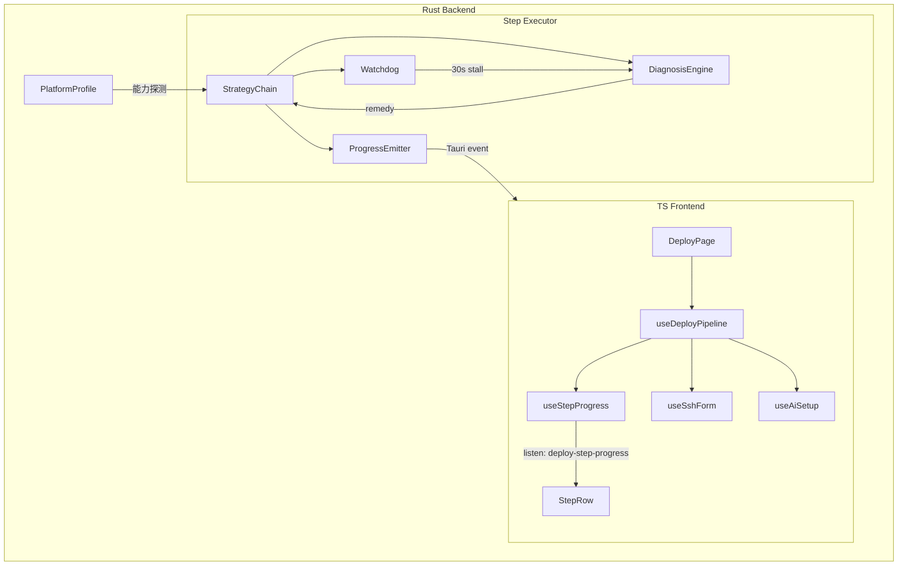

# 部署模块自愈式重构方案

## 一、架构总览



## 二、Rust 后端改动

### 2.1 新增: 统一进度协议 `StepProgress`

**位置**: [crates/clawno-core/src/types.rs](../crates/clawno-core/src/types.rs)

新增共享类型（两端都用）:

```rust
pub struct StepProgress {
    pub step_id: String,
    pub phase: String,          // downloading | installing | verifying | retrying | strategy-switch
    pub strategy_name: String,  // winget | choco | npm-tarball | direct-download ...
    pub strategy_idx: u8,
    pub strategy_total: u8,
    pub bytes_done: u64,
    pub bytes_total: u64,
    pub speed_bps: f64,
    pub pct: f32,               // 0.0 - 100.0
    pub eta_secs: f32,
    pub message: String,
    pub is_retrying: bool,
    pub error_sig: Option<String>,
    pub remedy: Option<String>,
}
```

替代当前 `DeployDownloadProgress`（apps/desktop/src-tauri/src/node/npm.rs L12-19），统一所有步骤的进度事件。

### 2.2 新增: 诊断引擎 `diagnosis.rs`

**位置**: `apps/desktop/src-tauri/src/deploy/diagnosis.rs` (新文件)

合并当前散落在各处的错误分类逻辑:

- `npm.rs` 的 `classify_npm_error()` (L73-111)
- `gateway.rs` 的 `diagnose_gateway_log()` (L51-62)
- `install.rs` 各处的 ad-hoc 错误检测

统一接口:

```rust
pub enum ErrorCategory {
    PermissionDenied, NetworkTimeout, NetworkUnreachable,
    DiskFull, CacheCorrupt, SslError, PortInUse,
    ConfigCorrupt, BinaryNotFound, VersionTooOld,
    ProcessStalled, ProcessCrash, Unknown,
}

pub enum RetryPolicy {
    AutoRetry,      // 网络/超时/缓存 → 自动重试
    UserPrompt,     // 权限/磁盘 → 提示用户后可重试
    Abort,          // 不可恢复
}

pub fn diagnose(stderr: &str, stdout: &str, exit_code: Option<i32>) -> Diagnosis;
pub fn retry_policy(category: &ErrorCategory) -> RetryPolicy;
pub fn suggest_remedies(diag: &Diagnosis, profile: &PlatformProfile) -> Vec<Remedy>;
```

### 2.3 新增: 策略链执行器 `executor.rs`

**位置**: `apps/desktop/src-tauri/src/deploy/executor.rs` (新文件)

核心执行引擎，每个部署步骤调用:

```rust
pub struct StrategyChain {
    step_id: String,
    strategies: Vec<Box<dyn Strategy>>,
    stall_timeout: Duration,  // 30s
    verifier: Box<dyn Fn() -> Option<String>>,
    emitter: ProgressEmitter,
}

impl StrategyChain {
    pub async fn execute(&mut self) -> StepResult {
        // 智能循环:
        // Pass 1: 按序尝试每个策略
        // Pass 2 (仅网络/超时类错误): 加指数退避重试
        // 策略执行中启动 watchdog, 30s stall → kill → 下一策略
        // 每次失败 → diagnose → 根据 RetryPolicy 决定:
        //   AutoRetry → 应用 remedy, 重试或下一策略
        //   UserPrompt → emit 特殊 progress 让前端提示
        //   Abort → 直接返回错误
        // 无论成败 → 调用 verifier 验证
    }
}
```

### 2.4 新增: 看门狗 `watchdog.rs`

**位置**: `apps/desktop/src-tauri/src/deploy/watchdog.rs` (新文件)

两种看门狗:

- **子进程看门狗**: spawn 子进程后起 tokio task 读 stdout/stderr，30s 无新输出 → kill
- **下载看门狗**: 用 `tokio::time::timeout` 包装每个 HTTP chunk 读取，30s 超时取消

```rust
pub async fn run_with_watchdog(
    cmd: &str,
    stall_timeout: Duration,
    on_output: impl Fn(&str),  // 实时输出回调
) -> WatchdogResult {
    // spawn 子进程
    // tokio::select! 同时监控 output 和 stall timer
    // stall → kill process → return Stalled
}
```

### 2.5 新增: 平台能力探测 `PlatformProfile`

**位置**: 扩展 [apps/desktop/src-tauri/src/platform.rs](../apps/desktop/src-tauri/src/platform.rs)

```rust
pub struct PlatformProfile {
    pub os: String,
    pub arch: String,
    pub is_chinese_locale: bool,
    pub has_winget: bool, pub has_choco: bool,
    pub has_brew: bool, pub has_nvm: bool, pub has_fnm: bool, pub has_volta: bool,
    pub has_apt: bool, pub has_dnf: bool, pub has_pacman: bool,
    pub free_disk_mb: u64,
    pub is_admin: bool,
    pub http_proxy: Option<String>,
}

pub fn detect_platform() -> PlatformProfile;
```

在部署开始时一次性探测，传入策略链，策略链据此动态排序可用安装方法。

### 2.6 重构: Node.js 安装 + 直接下载兜底

**位置**: [apps/desktop/src-tauri/src/node/install.rs](../apps/desktop/src-tauri/src/node/install.rs)

将当前 `install_node_auto` 的 if-else 塔重构为策略列表:

```
Windows: [winget, choco, fnm, nvm, direct_download_msi]
macOS:   [brew, nvm, fnm, direct_download_pkg]
Linux:   [apt+nodesource, dnf, pacman, nvm, direct_download_tar]
```

新增最终兜底策略 `direct_download_node`:

- 从 `https://nodejs.org/dist/v22.x.x/` 下载预编译包
- 使用 HTTP 流式下载 + `StepProgress` 推送真实进度
- 解压到 `~/.clawno/node/` 或 `%LOCALAPPDATA%/clawno/node/`
- 注入 PATH

每个策略内部支持:

- 输出捕获 → 进度事件推送
- 30s watchdog
- 失败后 diagnose → remedy

### 2.7 重构: npm 下载 + 安装

**位置**: [apps/desktop/src-tauri/src/node/npm.rs](../apps/desktop/src-tauri/src/node/npm.rs)

- HTTP 下载增加 30s stall timeout（当前无 chunk 超时）
- npm install 子进程用 `run_with_watchdog` 替代 `shell_result`，捕获实时输出
- 解析 npm 输出中的进度信息推送给前端

### 2.8 重构: Gateway 启动

**位置**: [apps/desktop/src-tauri/src/gateway.rs](../apps/desktop/src-tauri/src/gateway.rs) `deploy_step_start`

- 将 3 轮固定 wait 改为持续 probe + progress event 推送
- 每秒推送 probe 状态（"等待服务启动... 已等待 8s"）
- 集成 diagnosis engine 统一处理 PortInUse / ConfigCorrupt / Crash

### 2.9 改造: SSH 流式执行

**位置**: [crates/clawno-core/src/ssh.rs](../crates/clawno-core/src/ssh.rs)

新增流式版本:

```rust
pub async fn ssh_exec_streaming<F>(
    args: &SshArgs,
    script: &str,
    on_line: F,
) -> Result<(i32, String), String>
where
    F: Fn(&str) + Send + 'static,
{
    // 使用 russh channel 逐行读取输出
    // 每行通过 on_line 回调推送
    // 解析关键里程碑: "npm install done", "node v22.x" 等
}
```

在 `ssh_deploy.rs` 的 5 个命令中改用 streaming 版本，通过 Tauri event 推送到前端。

---

## 三、TS 前端改动

### 3.1 拆分 `useDeployState.ts` (497行 → 4个focused hooks)

**当前**: apps/desktop/src/pages/deploy/useDeployState.ts 是 497 行巨型 hook

拆为:

- `useDeployPipeline.ts` (~150行): 只负责步骤编排 + 状态机
- `useStepProgress.ts` (~80行): 监听 `deploy-step-progress` event, 计算渲染数据
- `useSshForm.ts` (~60行): SSH 表单状态
- `useAiSetup.ts` (~60行): AI provider 配置逻辑

### 3.2 扩展 `types.ts`

**位置**: apps/desktop/src/pages/deploy/types.ts

新增 `StepProgress` 类型（对齐 Rust 侧），扩展 `StepState`:

```typescript
export interface StepProgress {
  stepId: string;
  phase: string;
  strategyName: string;
  strategyIdx: number;
  strategyTotal: number;
  bytesDone: number;
  bytesTotal: number;
  speedBps: number;
  pct: number;
  etaSecs: number;
  message: string;
  isRetrying: boolean;
  errorSig?: string;
  remedy?: string;
}

export interface StepState extends StepDef {
  status: StepStatus;
  progress?: StepProgress;  // 替代当前的 downloadProgress
  elapsedSec: number;
  fixes_applied: string[];
}
```

### 3.3 重构 `StepRow.tsx`

**位置**: apps/desktop/src/pages/deploy/StepRow.tsx

渲染新增信息:

- 当前策略名称 + 序号（如 "策略 2/4: choco"）
- 真实进度条（字节/百分比，不再靠时间估算）
- 实时速度 + 剩余时间 + 剩余字节量
- 策略切换提示（"检测到超时，切换到下一方案..."）
- 自愈状态（"发现权限问题，尝试用户目录安装..."）
- retrying 状态的 pulse 动画

---

## 四、文件变更清单

### 新增文件 (4)

- `apps/desktop/src-tauri/src/deploy/executor.rs` - 策略链执行器
- `apps/desktop/src-tauri/src/deploy/diagnosis.rs` - 统一诊断引擎
- `apps/desktop/src-tauri/src/deploy/watchdog.rs` - 30s stall 看门狗
- `apps/desktop/src/pages/deploy/useStepProgress.ts` - 进度监听 hook

### 重构文件 (8)

- `crates/clawno-core/src/types.rs` - 新增 StepProgress 共享类型
- `crates/clawno-core/src/ssh.rs` - 新增 ssh_exec_streaming
- `apps/desktop/src-tauri/src/platform.rs` - 新增 PlatformProfile + detect_platform
- `apps/desktop/src-tauri/src/node/install.rs` - 策略链化 + Node.js直接下载
- `apps/desktop/src-tauri/src/node/npm.rs` - 统一进度 + stall timeout
- `apps/desktop/src-tauri/src/gateway.rs` - 集成 executor + 持续 probe
- `apps/desktop/src/pages/deploy/useDeployState.ts` - 瘦身拆分
- `apps/desktop/src/pages/deploy/StepRow.tsx` - 渲染新进度信息

### 小改文件 (4)

- `apps/desktop/src-tauri/src/deploy/mod.rs` - 引入新子模块
- `apps/desktop/src-tauri/src/pm2.rs` - 安装步骤走 executor
- `apps/desktop/src/pages/deploy/types.ts` - 新增类型定义
- `apps/desktop/src/pages/DeployPage.tsx` - 适配新 hook 接口

---

## 五、实施顺序

分 4 个阶段，每个阶段可独立编译运行:

**阶段 1 (基础设施)**: 新增 StepProgress 类型 + 诊断引擎 + 看门狗 + PlatformProfile

**阶段 2 (后端重构)**: 策略链执行器 + 改造各步骤 + Node.js 直接下载 + SSH 流式

**阶段 3 (前端重构)**: 拆分 useDeployState + 新进度渲染 + StepRow 升级

**阶段 4 (集成联调)**: 打通事件流 + 端到端测试 + 边界情况处理
